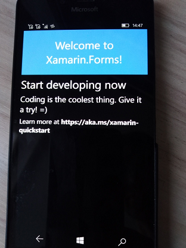

# Win3Mu 0.3.0-alpha
C# Windows 3.x emulator

RnD only. Not for any end user.

## About
forked/imported from https://bitbucket.org/toptensoftware/win3mu

The author: Brad Robinson (an independent software developer)

My idea is old as our brave world: UWP port of Win3Mu; Win 3 app "native" emulation for old poor PC, etc. :) 

Now for now, Win3Mu just "usual" .NET 4.8 app, not UWP app 

## Screenshots

## Progress (status)
RnD phase +-

Design phase +-

Tech phase +-

Dev phase +- (the code base rapidly converted into UWP / Xamarin Forms + downshifted to .NET 1.4)

Intro -

## Articles for your own dev
Part 01. Why I’m writing a Windows 3 Emulator

https://hackernoon.com/win3mu-part-1-why-im-writing-a-16-bit-windows-emulator-2eae946c935d

Part 02. Initial Design Thoughts on Building a Windows 3 Emulator

https://medium.com/hackernoon/win3mu-part-2-initial-design-thoughts-45f996b5199d#.ufv3paxrh

Part 03. The CPU

https://medium.com/hackernoon/win3mu-part-3-the-cpu-d9c9a9417731#.3dvjb8q28

Part 04. Protected Mode

https://medium.com/hackernoon/win3mu-part-4-protected-mode-af299a3a0b9a#.vomkis7i5

Part 5. Windows 3 Executable Files

https://medium.com/hackernoon/win3mu-part-5-windows-3-executable-files-c2affeec0e5#.xpq57fcjx

Part 06. Memory Management

https://medium.com/hackernoon/win3mu-part-6-memory-management-289233ef351#.icpakm4ka

Part 07. Thunking

https://medium.com/hackernoon/win3mu-part-7-thunking-bb02944cff42#.h58rh5tjo

Part 08. The Module Loader

https://medium.com/hackernoon/win3mu-part-8-the-module-loader-64ce8d52a4ed#.536yr4irh

Part 09. Path Mapping

https://medium.com/@toptensoftware/win3mu-part-9-path-mapping-3e2ddaadd16c#.4ru8zgzef

Part 10. Leveraging Reflection

https://medium.com/@toptensoftware/win3mu-part-10-leveraging-reflection-454522241637#.o2dsj7jbw

## Youtube "videotutorials"

Introducting Win3mu!

https://www.youtube.com/watch?v=yYsl5B_CefU

Repackage with Win3mu

https://www.youtube.com/watch?v=OBpEU0PXbYM

## How-to to improve this RnD project

- Clone the src code

- Use VS 2022 to RnD it

- Learn the differences .NET 4.8 and .NET Standard 1.4

- Downgrade the code to 1.4...

- Debug, fix bugs, etc. 

- Get your UWP benefits

See "Repackage with Win3mu" video if you don't undestand this cool feature :)

- if you want to manually run ski.exe then simply type/enter the command:
win3mu ski.exe

## More tech details (building, etc.)

https://www.toptensoftware.com/win3mu/

AS IS. Win3Mu is RnD only, not for "gaming". 

-- [m][e] 2022

